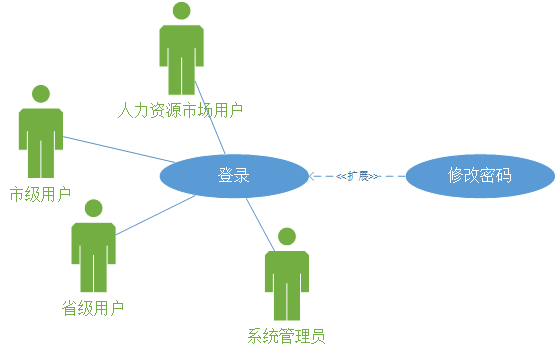

# 省人力资源市场数据采集系统
## 软件需求规格说明书
## 版本 <1.0>

> ## 目录
1. [简介](#1)  
1.1 [目的](#1.1)  
1.2 [范围](#1.2)  
1.3 [定义、首字母缩写词和缩略语](#1.3)  
1.4 [参考资料](#1.4)  
1.5 [概述](#1.5)  
2. [整体说明](#2)  
2.1 [产品总体效果](#2.1)  
2.2 [产品功能](#2.2)  
2.3 [用户特征](#2.3)  
2.4 [约束](#2.4)  
3. [具体需求](#3)  
3.1 [功能](#3.1)  
3.2 [可靠性](#3.2)  
3.3 [性能](#3.3)  
3.4 [扩展性要求](#3.4)  
3.5 [运行环境规定](#3.5)  
3.6 [设计约束](#3.6)  
3.7 [联机用户文档和帮助系统需求](#3.7)  
3.8 [购买的构件](#3.8)  
3.9 [接口](#3.9)  
3.10 [许可需求](#3.10)  
3.11 [法律、版权及其他声明](#3.11)  
3.12 [适用的标准](#3.12)  
4. [支持信息](#4)

## 软件需求规约

<h2 id="1">1. 简介</h2>

<h3 id="1.1">1.1 目的</h3>

&emsp;&emsp;本文档是省人力资源市场数据采集系统项目的需求分析说明书。本文档主要记录和详细分析了项目业务需求，详细分析了系统的功能需求和非功能需求。本文档的编写目的主要是为了青海省人力资源市场数据采集系统项目的升级改造提供依据，同时便于开发人员与客户沟通交流。

<h3 id="1.2">1.2 范围</h3>

&emsp;&emsp;本文档适用于省人力资源市场数据采集系统项目，用于开发人员与客户沟通交流依据以及开发过程的指导。

<h3 id="1.3">1.3 定义、首字母缩写词和缩略语</h3>

* SRS：软件需求规格说明书。
* 监测点用户：人力资源市场用户。
* 市用户：市就业管理部门。
* 省用户：省就业管理部门。
* 假删除：信息仍在，但处于失效状态。

<h3 id="1.4">1.4 参考资料</h3>

* 《供求总体情况表》
* 《各产业劳动力需求情况表》
* 《行业需求情况表》
* 《用人单位需求情况表》
* 《各类职业供求情况表》
* 《求职人员构成情况表》
* 《招聘、应聘条件情况表》

<h3 id="1.5">1.5 目的</h3>

&emsp;&emsp;本文档阐述了省人力资源市场数据采集系统的功能性以及非功能性需求，按照面向对象的分析方法进行分析。

<h2 id="2">2. 整体说明</h2>

<h3 id="2.1">2.1 产品总体效果</h3>

&emsp;&emsp;省内人口众多，为了更便捷更高效的收集省内就业数据，并管理各企事业单位及各人力资源市场，因此开发该系统，使调查汇总就业情况形成自动化。

<h3 id="2.2">2.2 产品功能</h3>

&emsp;&emsp;各人力资源市场通过该系统上报数据，经上级部门审核批准后，进行全省（市）数据统计。

<h3 id="2.3">2.3 用户特征</h3>

* 省用户：省就业管理部门。
* 市用户：市就业管理部门。
* 监测点用户：人力资源市场。
* 系统管理员。

&emsp;&emsp;以上用户的特征是：会基本的业务操作，但不精通计算机专业知识。仅对办公软件比较熟悉。

<h3 id="2.4">2.4 约束</h3>

* 经费限制：10万人民币
* 开发期限：2016年8月30日完成

<h2 id="3">3. 具体需求</h2>

<h3 id="3.1">3.1 功能</h3>

#### 3.1.1 用户登录模块

##### 3.1.1.1 登录

| 用例名称：登录 |
| - |
| 描述：用户通过输入账号和密码进入系统 |
| 标识符：uc01 |
| 优先级：A(高) |
| 角色: 省级用户，市级用户，系统管理员，人力资源市场用户 |
| 前置条件：无 |
| 主事件流： 1. 用户进入网站，用例开始。 2. 用户输入账号，密码，系统检查账号密码有效性。 &emsp;A1：账号无效。 &emsp;A2：密码错误。 &emsp;A3：网络错误。 3. 显示登录成功，根据用户角色进入对应系统。 4. 用例结束。 |
| 其他事件流： A1: 账号无效 &emsp;(1) 系统显示账号无效的提示信息。 &emsp;(2) 返回主事件流第2步。 A2:密码错误 &emsp;(1) 系统显示密码错误的提示信息。 &emsp;(2) 返回主事件流第2步。 A3：网络错误 &emsp;(1) 系统显示网络错误提示信息。 &emsp;(2) 跳至主事件流第2步。 |
| 后置条件：无 |
| 特殊需求： |

##### 3.1.1.2 修改密码

| 用例名称：修改密码 |
| - |
| 描述： 用户可随时修改本账号密码 |
| 标识符：uc02 |
| 优先级：A(高) |
| 角色: 省级用户，市级用户，系统管理员，人力资源市场用户 |
| 前置条件：无 |
| 主事件流： 1. 用户选择“修改密码”，用例开始。 2. 用户输入原密码，系统检查密码正确性。 &emsp;A1：原密码错误。 3. 用户输入新密码，重复输入新密码，系统验证新密码有效性。 &emsp;A2：新密码格式无效。 &emsp;A3：重复密码与新密码不一致。 4. 用例结束。 |
| 其他事件流： A1: 原密码错误 &emsp;(1) 系统显示账号无效的提示信息。 &emsp;(2) 返回主事件流第2步。 A2:新密码格式无效。 &emsp;(1) 系统显示密码错误的提示信息，及格式要求。 &emsp;(2) 返回主事件流第3步。 A3：重复密码与新密码不一致 &emsp;(1) 系统显示密码不一致提示信息。 &emsp;(2) 跳至主事件流第3步。 |
| 后置条件：系统后台成功修改密码。 |
| 特殊需求：密码有效性包括（长度6位~20位，由字母、数字和‘-’、‘_’，禁止使用中文或‘?’、‘%’等字符），重复密码与输入新密码相同。 |

